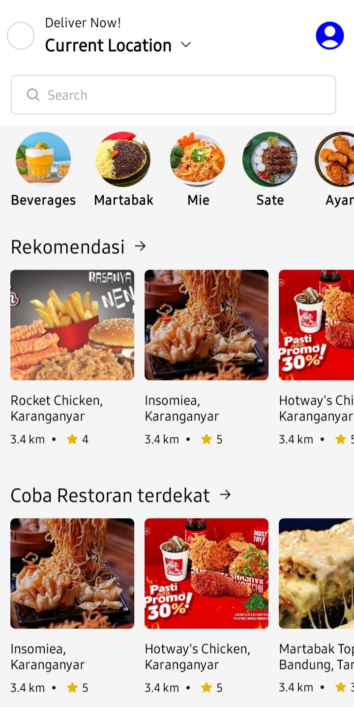
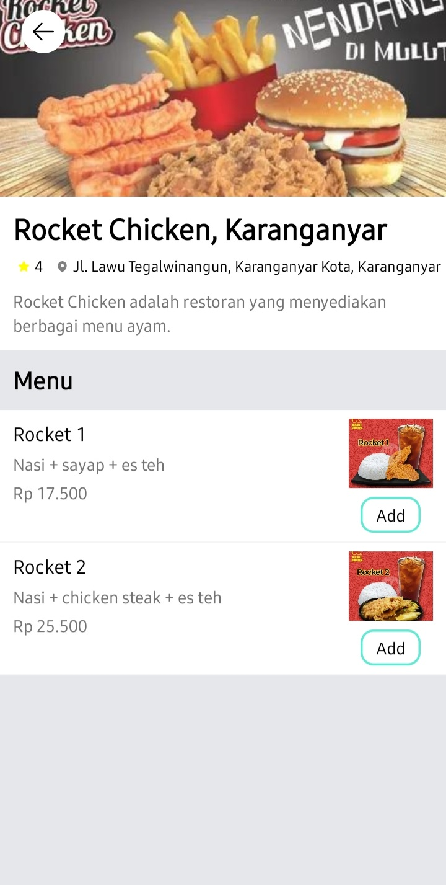
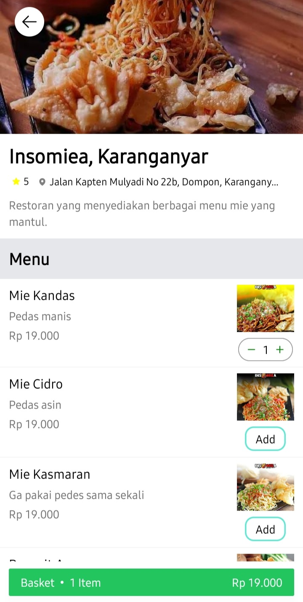
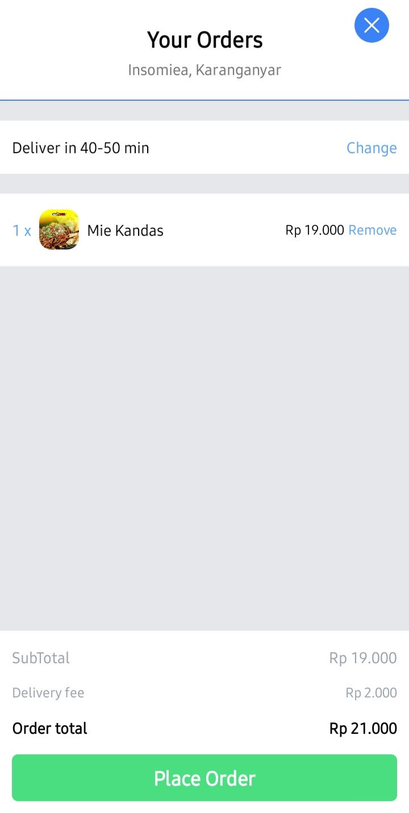

# Kirimin

Kirimin Mobile App for food order and delivery. Developed with React Native! (Navigation, Redux, Tailwindcss, Sanity.io)

<!-- Screenshots -->
## Screenshots

 
 
 
 
 

 

## Tech Stack

- **Framework:** [React Native](https://nextjs.org)
- **Styling:** [Tailwind CSS](https://tailwindcss.com)
- **Content Management:** [Sanity](https://www.sanity.io/)